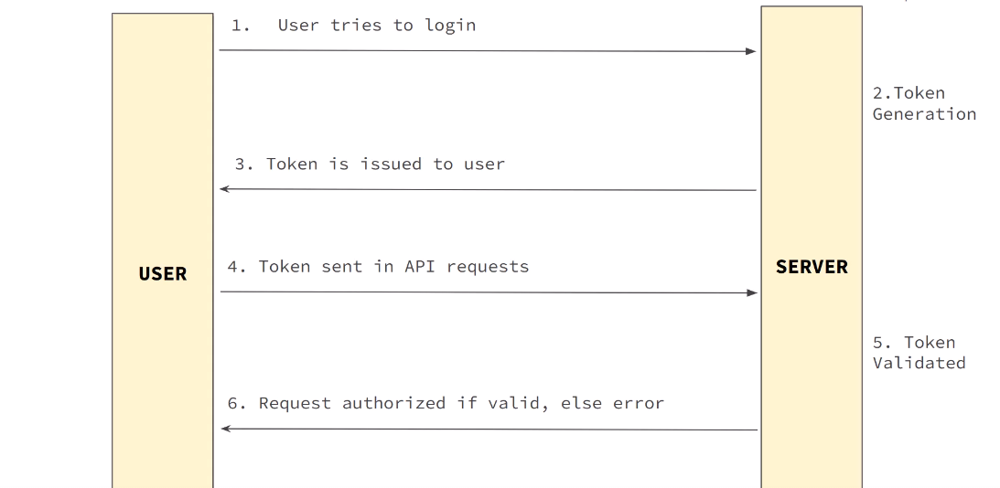

JwtUtils -> Contains the utility methods for generating, parsing and validating the JWT's.
         -> Include generating a token for username, validating a jwt and extracting the username from token.



# 🔐 JWT, Interfaces, and Cryptographic Signing — Conceptual Notes

This document serves as both **revision notes** and **project documentation** covering Java interfaces, JWTs, and Spring Security cryptographic concepts.

---

## 1. Programming to an Interface (Core Java Concept)

### What it means
Programming to an interface means writing code that depends on an **interface (contract)** rather than a concrete class.

**Benefits:**
- Flexibility
- Testability
- Decoupling

```java
public String generateTokenNameFromUserName(UserDetails userDetails)
```

- `UserDetails` is an **interface**
- Any class implementing `UserDetails` can be passed
- The method depends only on what the interface guarantees (e.g., `getUsername()`)

### Why not pass concrete classes?
- Passing concrete classes (e.g., `User`) tightly couples code
- Interfaces allow swapping implementations without changing method signatures

---

## 2. `UserDetails` in Spring Security

- `UserDetails` is an **interface**
- It is always implemented at runtime:
    - By Spring’s `User` class
    - Or by a custom `CustomUserDetails`
- You never instantiate `UserDetails` directly

**Key idea:**
> Interfaces are used at compile time, concrete objects exist at runtime.

---

## 3. JWT Basics (Big Picture)

A JWT (JSON Web Token) consists of three parts:

```
header.payload.signature
```

Each part is **Base64URL-encoded**.

---

## 4. Claims vs Subject

### Claims
Every key–value pair in the JWT payload is a **claim**.

Example payload:

```json
{
  "sub": "john_doe",
  "iat": 1704900000,
  "exp": 1704903600,
  "role": "ADMIN"
}
```

### Subject (`sub`)
- `sub` is a **standard (registered) claim**
- Represents who the token is about
- Used by Spring Security as the principal identity

✅ Subject is a claim  
✅ All payload entries are claims  
🔹 Subject is just a special, standardized one

---

## 5. JWT Creation (`Jwts.builder()`)

```java
Jwts.builder()
    .setSubject(username)
    .setIssuedAt(new Date())
    .setExpiration(new Date(now + expiration))
    .signWith(key)
    .compact();
```

### What each step does

| Step | What it builds |
|----|----|
| `setSubject`, `setIssuedAt`, `setExpiration` | Payload (claims) |
| `signWith(key)` | Determines header + creates signature |
| `compact()` | Base64URL-encodes and assembles JWT |

---

## 6. Why `"header.payload"` is Signed

The signature is computed over:

```
base64(header) + "." + base64(payload)
```

### Why the `"."`?
- Standard delimiter
- Not part of Base64URL alphabet
- Guarantees unambiguous parsing

### Why sign both header and payload?
- Header contains critical metadata (`alg`, `kid`)
- Signing prevents tampering with algorithm or claims

---

## 7. What Signing Actually Does (Tamper Protection)

Signing guarantees:
- ✅ Integrity (token not modified)
- ✅ Authenticity (issued by trusted server)
- ❌ No encryption (data is readable)

Important notes:
- Signing is deterministic
- Same header + payload + key → same signature
- Uniqueness comes from claims like `iat`, `exp`, or `jti`

---

## 8. Base64 ≠ Encryption

- Base64 is **encoding**, not encryption
- Anyone can decode JWT payload
- **Never store secrets** in claims

Security comes from **signature verification**, not hiding data.

---

## 9. Why JWTs Are Safe Over HTTPS

- HTTPS (TLS) protects the token **in transit**
- JWT signature protects the token **from tampering**
- Combined → secure, stateless authentication

---

## 10. JWT Verification (`parseSignedClaims()`)

```java
Jwts.parser()
    .verifyWith(key)
    .build()
    .parseSignedClaims(token);
```

This is where the **“magic”** happens.

Internally:
1. Split token → `H.P.S`
2. Base64URL-decode header & payload
3. Recompute signature from `H.P`
4. Compare signatures
5. Validate `exp`, `nbf`, `iat`
6. Return trusted claims

❌ Never manually decode JWTs  
✅ Always parse + verify together

---

## 11. Signing vs Verifying (HS256 vs RS256)

### HS256 (Symmetric)
- Same secret key signs and verifies

```
Sign   → secret key
Verify → same secret key
```

### RS256 (Asymmetric)
- Private key signs
- Public key verifies

```
Sign   → private key
Verify → public key
```

---

## 12. `Key` vs `Keys` (Java Crypto Abstraction)

```java
public Key key() {
    return Keys.hmacShaKeyFor(
        Decoders.BASE64.decode(jwtSecretKey)
    );
}
```

- `Key` → interface (`java.security.Key`)
- `Keys` → factory utility class
- `hmacShaKeyFor()` returns a `SecretKey` (implements `Key`)

Same concept as:

```java
List<String> list = new ArrayList<>();
```

---

## 13. Why Same Key Is Needed for Verify (HS256)

- HS256 uses HMAC
- Verification recomputes signature using the same secret
- If keys differ → verification fails

---

## 14. Final Mental Model

JWT creation builds claims (payload), derives a header from the signing key, signs `header.payload` using cryptography, and assembles everything into a Base64URL string. Verification reverses the process by recomputing the signature from the received header and payload and comparing it with the attached one. The signature prevents tampering, HTTPS protects the token in transit, and interfaces ensure clean, flexible Java design.

---
